# PaySchedManager — Complete User Guide

> A step-by-step manual for the Expense / Payment Schedule Dashboard. It covers every screen, every button, every form field, and every workflow — from logging in for the first time to recording payments, importing bank transactions, running reports, and auditing changes.

This guide is written so that a brand-new user can read it top to bottom and become fully proficient, and so that an experienced user can jump to any section to answer a specific question. Screenshots throughout show the real application.

---

## Table of Contents

1. [What this app is for](#1-what-this-app-is-for)
2. [Key concepts & glossary](#2-key-concepts--glossary)
3. [Logging in & accounts](#3-logging-in--accounts)
4. [The dashboard at a glance](#4-the-dashboard-at-a-glance)
5. [The four KPI cards](#5-the-four-kpi-cards)
6. [Overview tab — charts & panels](#6-overview-tab--charts--panels)
7. [Drill-downs & expense details](#7-drill-downs--expense-details)
8. [Schedules tab — managing obligations](#8-schedules-tab--managing-obligations)
9. [Adding a payment schedule](#9-adding-a-payment-schedule)
10. [Recording a payment](#10-recording-a-payment)
11. [Editing & deleting a schedule](#11-editing--deleting-a-schedule)
12. [History tab — recorded payments](#12-history-tab--recorded-payments)
13. [Editing, deleting & attaching files to payment records](#13-editing-deleting--attaching-files-to-payment-records)
14. [Importing transactions from CSV](#14-importing-transactions-from-csv)
15. [Exporting reports (CSV & PDF)](#15-exporting-reports-csv--pdf)
16. [Settings — companies, accounts, types, users](#16-settings--companies-accounts-types-users)
17. [The audit log](#17-the-audit-log)
18. [Roles & permissions](#18-roles--permissions)
19. [End-to-end workflows (recipes)](#19-end-to-end-workflows-recipes)
20. [Frequently asked questions](#20-frequently-asked-questions)
21. [Troubleshooting](#21-troubleshooting)

---

## 1. What this app is for

PaySchedManager tracks **money your business owes and pays out**. It answers questions like:

- *How much do we spend per month on recurring commitments?*
- *What is due in the next 7 / 30 / 90 days, and to whom?*
- *What is overdue right now?*
- *Did we actually pay it — when, from which account, and who approved it?*
- *Is anything underpaid, overpaid, or paid late?*

You set up **payment schedules** (recurring or one-time obligations such as rent, loans, subscriptions, taxes, and vendor bills). As you pay them, you record **payment records** against those schedules. The dashboard then turns all of that into forecasts, breakdowns, trends, and an attention list of problems — and keeps a tamper-evident audit trail of every change.

The app supports multiple **internal companies** (business units / entities) so one login can manage payments across an entire group.

---

## 2. Key concepts & glossary

Understanding these eight terms makes the rest of the app obvious.

| Term | What it means |
|---|---|
| **Internal Company** | A business entity you pay *from* (e.g., *Trans Fine Jewelry*, *Alexander DM*). Every schedule and account belongs to one. Has a short **abbreviation** (e.g., `TFJ`). |
| **Payment Schedule** (also called an *expense* or *obligation*) | A commitment to pay a vendor — recurring (monthly rent) or one-time. Holds the amount, frequency, next due date, the account it pays from, and a unique **Expense ID**. |
| **Payment Record** | Proof that a payment actually happened: date, amount, method, account, who approved it, and optional file attachments. Usually linked to a schedule. |
| **Payment Account** | A bank account or card you pay *with* (e.g., *“010 – TFJ CHA CC 9xxx”*). Belongs to an internal company. Identified by its **last 4 digits**. |
| **Vendor** | Who you pay *to* (Netflix, a landlord, the IRS). Stored as a name plus a short **abbreviation** used to build the Expense ID. |
| **Expense Type** | A category for analytics (e.g., *Operating Expense*, *Rent*, *Tax*, *Subscription Services*, *Auto Loan*). |
| **Payment Type / Method** | How money moves (Check, ACH, Wire, Credit Card, Debit Card, Bank Transfer, PayPal, Cash, etc.). |
| **Frequency** | How often a schedule repeats: **one-time, weekly, bi-weekly, monthly, quarterly, yearly**. |

**Status badges** appear on schedules everywhere in the app:

| Badge | Meaning |
|---|---|
| 🟢 **Paid** | The obligation is settled / marked complete. |
| 🟠 **Due Soon** | Due within the next 7 days. |
| 🔴 **Overdue** | The due date has passed and no payment is recorded. |
| 🔵 **Scheduled** | Upcoming, but not within the “due soon” window. |
| ⚪ **Inactive** | Switched off — excluded from all totals and forecasts. |

**Expense ID** is generated automatically from the company/vendor abbreviations and a sequence number, e.g. `TFJ-TFJ-001`. You never type it by hand.

---

## 3. Logging in & accounts

When you open the app you land on the sign-in screen.

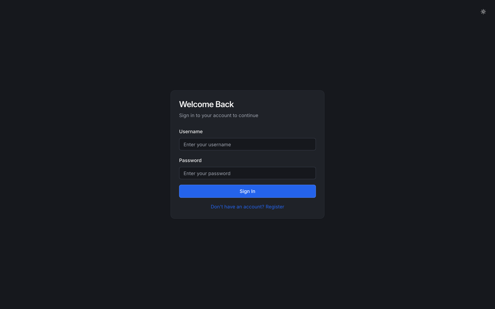

**To sign in:**

1. Enter your **Username**.
2. Enter your **Password**.
3. Click **Sign In**.

You are taken straight to the dashboard. Your session stays active until you log out (the logout button is in the dashboard header).

**Creating an account.** Click **“Don't have an account? Register”** to switch the card into registration mode, then fill in a username and password and click **Create Account**. In most deployments, however, **new users are created by an administrator** from *Settings → Users* (see §16) so that roles are assigned correctly. If self-registration is disabled or you don’t know your credentials, ask an admin to create your account.

**Light / dark theme.** The ☀️ / 🌙 toggle in the top-right corner switches between light and dark mode at any time, including on the login screen. All screenshots in this guide use dark mode.

> **Tip:** If you are already logged in, opening the app skips this screen and goes directly to the dashboard.

---

## 4. The dashboard at a glance

After signing in you see the **Expense Dashboard** — the home screen and the hub for everything.

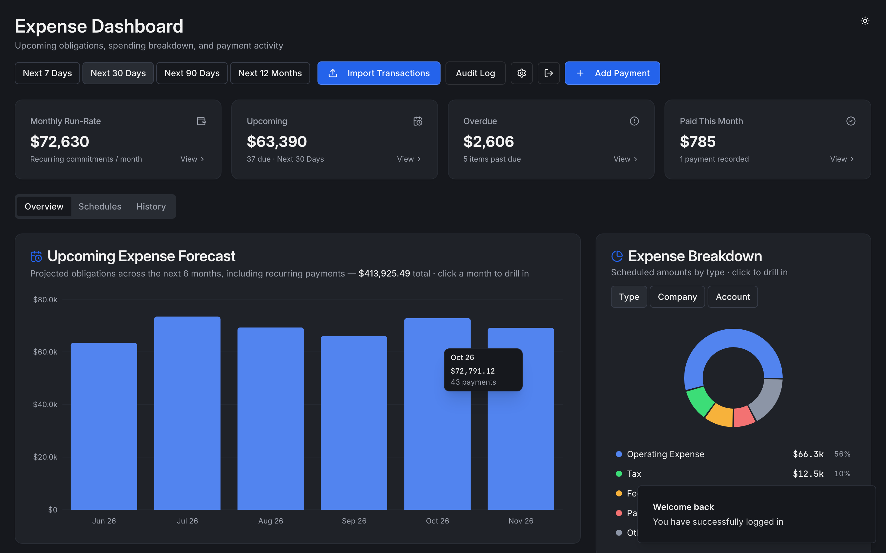

**The header (top bar)** contains, from left to right:

- **Title & subtitle** — “Expense Dashboard / Upcoming obligations, spending breakdown, and payment activity.”
- **Timeframe selector** — `Next 7 Days` · `Next 30 Days` · `Next 90 Days` · `Next 12 Months`. This controls the **Upcoming** KPI and the **Upcoming Payments** panel. Changing it re-scopes those numbers instantly.
- **Import Transactions** — opens the CSV importer (§14).
- **Audit Log** — opens the audit ledger (admins only, §17).
- **⚙️ Settings** — opens configuration (§16).
- **⏻ Logout** — ends your session.
- **+ Add Payment** — the primary action; creates a new payment schedule (§9).

Directly under the header are the **four KPI cards** and then the **Overview / Schedules / History** tabs.

---

## 5. The four KPI cards

Each card is a live number **and** a button — click any card to drill into the exact items behind it.

| Card | What the number means | Click to see… |
|---|---|---|
| **Monthly Run-Rate** | Every recurring schedule converted to a per-month amount and summed — your “steady-state” monthly spend. | The full list of recurring items with their monthly-equivalent amounts. |
| **Upcoming** | Total due within the **timeframe** chosen in the header, with the count (e.g., “37 due · Next 30 Days”). | Every obligation due in that window. |
| **Overdue** | Total past its due date with no recorded payment, plus the count of items. | Every overdue item, so you can act on it. |
| **Paid This Month** | Total of payment **records** dated in the current calendar month, with the count. | Each payment recorded this month. |

In the screenshot above: Monthly Run-Rate **$72,630**, Upcoming **$63,390** (37 due, next 30 days), Overdue **$2,606** (5 items), Paid This Month **$785** (1 payment). Your numbers will differ.

> Clicking a card opens the **drill-down dialog** described in §7.

---

## 6. Overview tab — charts & panels

The **Overview** tab is the default view. It has four analytic regions plus a trend chart at the bottom.

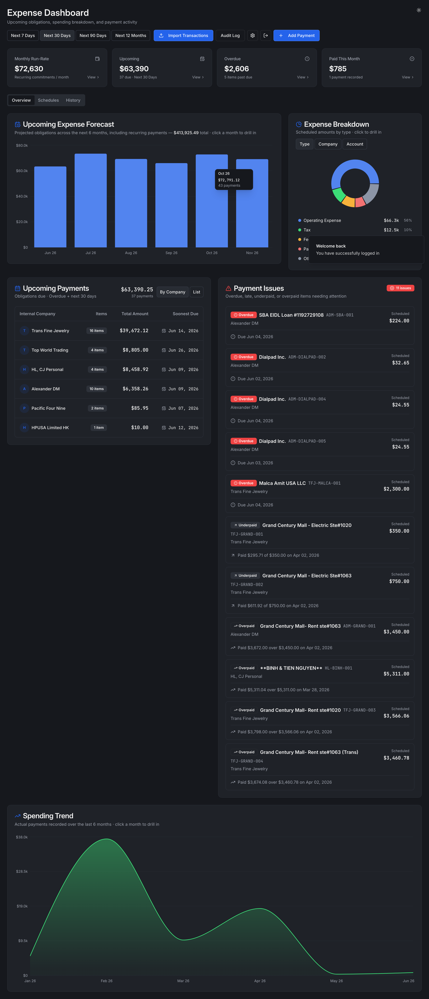

### 6.1 Upcoming Expense Forecast (bar chart)
Projects total obligations for each of the next several months, including recurring repeats and one-time items. The headline shows the grand total across the window. **Click any bar/month** to drill into every payment due that month (hovering shows a tooltip with the month, projected total, and number of payments).

### 6.2 Expense Breakdown (donut chart)
Shows where the money goes. Use the **Type · Company · Account** toggle to regroup the same spend three ways. The legend lists each slice with its dollar amount and percentage. **Click a slice** to drill into the items in that category.

### 6.3 Upcoming Payments (operational panel)
Lists what’s coming due within the header’s timeframe. A **List / By Company** toggle switches between:

- **List** — individual obligations sorted by due date, each with a **Record Payment** button.
- **By Company** — totals grouped per internal company (total amount, number scheduled, soonest due date), with a drill-down arrow.

A running subtotal (amount and count) sits at the bottom.

### 6.4 Payment Issues (attention panel)
Your problem list. A red badge shows the issue count (green “All clear” when there are none). Each card flags one of four problem types:

| Issue | Trigger |
|---|---|
| **Overdue** | Past due with no payment recorded. |
| **Late Payment** | A payment was recorded *after* the scheduled due date. |
| **Underpaid** | The latest payment was **less** than the scheduled amount. |
| **Overpaid** | The latest payment was **more** than the scheduled amount. |

Each card shows the vendor, company, amount, and a plain-English detail line (e.g., *“Paid $3,510 of $3,672 …”*). **Click a card** to open the full expense detail (§7).

### 6.5 Spending Trend (area chart)
Plots **actual recorded payments** by month for the recent past — what truly left your accounts, as opposed to what was merely scheduled. **Click a month** to drill into the payments recorded then.

---

## 7. Drill-downs & expense details

Every clickable number, bar, slice, and issue opens one of two dialogs.

### 7.1 Drill-down dialog
Opened from KPI cards, chart elements, and company rows. It lists every item behind the number you clicked.

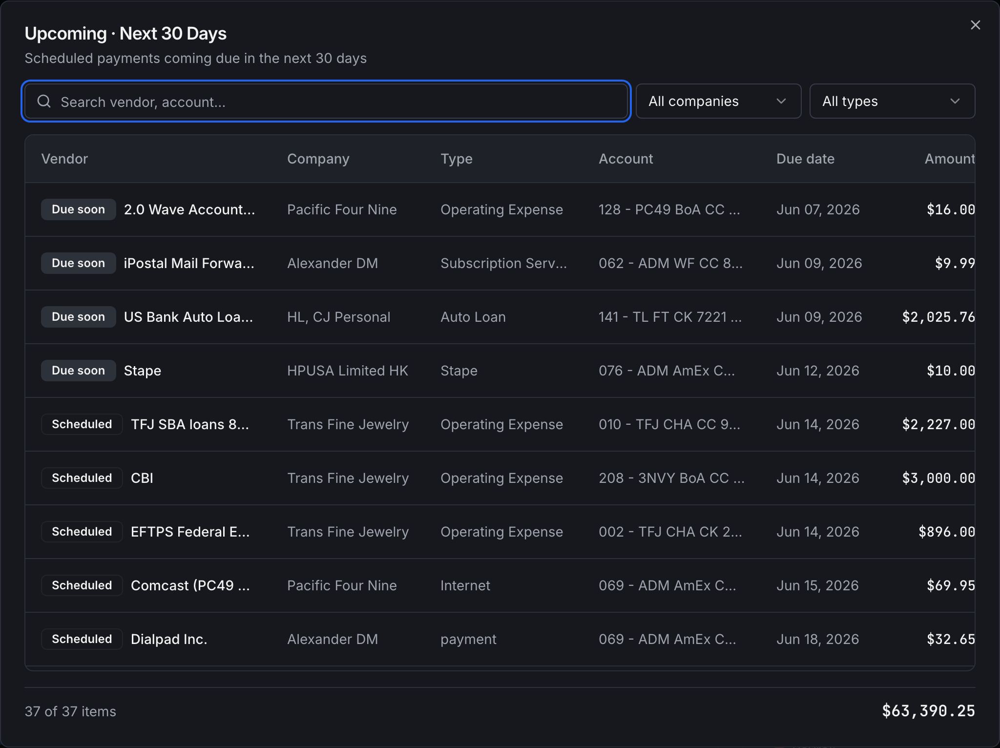

It includes:

- A **title** describing the context (e.g., *“Upcoming · Next 30 Days”*).
- A **search box** (filter by vendor or account).
- **All companies** and **All types** dropdown filters.
- A table: **Vendor · Company · Type · Account · Due date · Amount**.
- A **total** of all rows shown, plus an item count (e.g., *“37 of 37 items — $63,390.25”*).

**Click any row** to open its expense detail.

### 7.2 Expense detail dialog
The full picture of a single schedule:

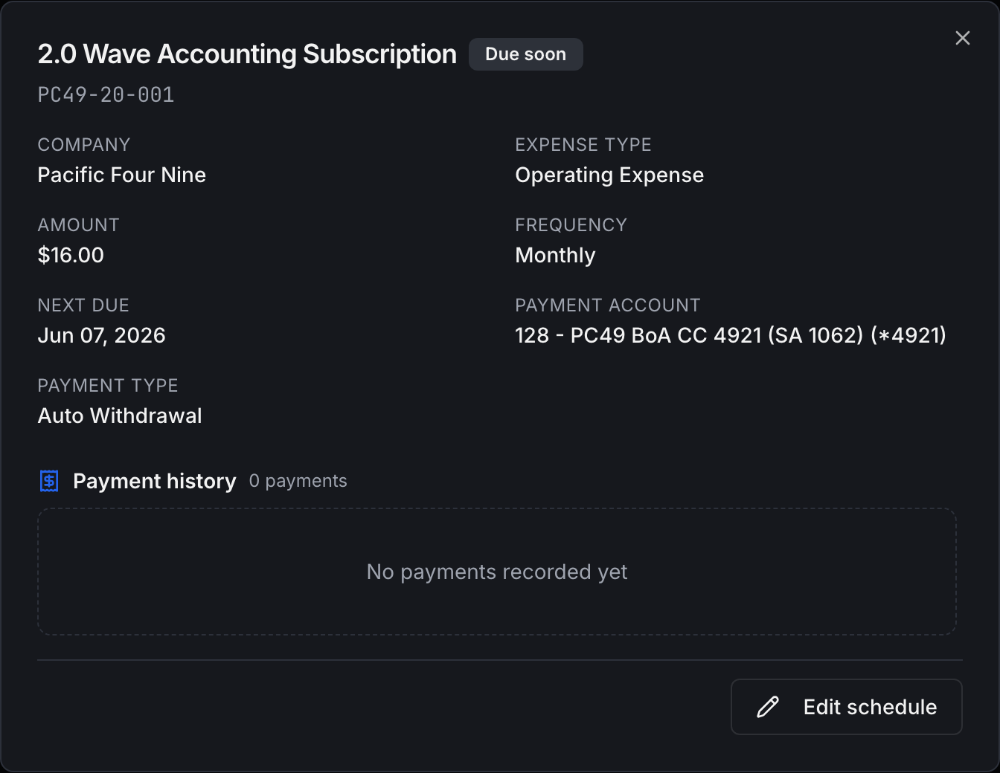

- Vendor name, Expense ID, status badge, and active/inactive state.
- A details table: company, expense type, amount, frequency, next due date, payment account, payment type.
- A **payment history** sub-table listing every recorded payment for that schedule (date, amount, method, account, days late, confirmation indicator). The row matching the item you drilled in from is highlighted.
- An **Edit Schedule** button (admins) that jumps straight to the edit form (§11).

This is the fastest way to investigate any single obligation end to end.

---

## 8. Schedules tab — managing obligations

The **Schedules** tab shows every obligation as a card grid.

**Filter and find:**

- Filter toggle: **All · Recurring · Due Soon · Overdue**.
- **Search** by vendor, Expense ID, or company.

**Each card shows:** the Expense ID (small mono text), the vendor name, a **status badge**, the amount (large), the due date in relative terms (“Due in 3 days”), and the frequency. Inactive schedules appear dimmed.

**The ⋯ (three-dot) menu** on each card opens its actions:

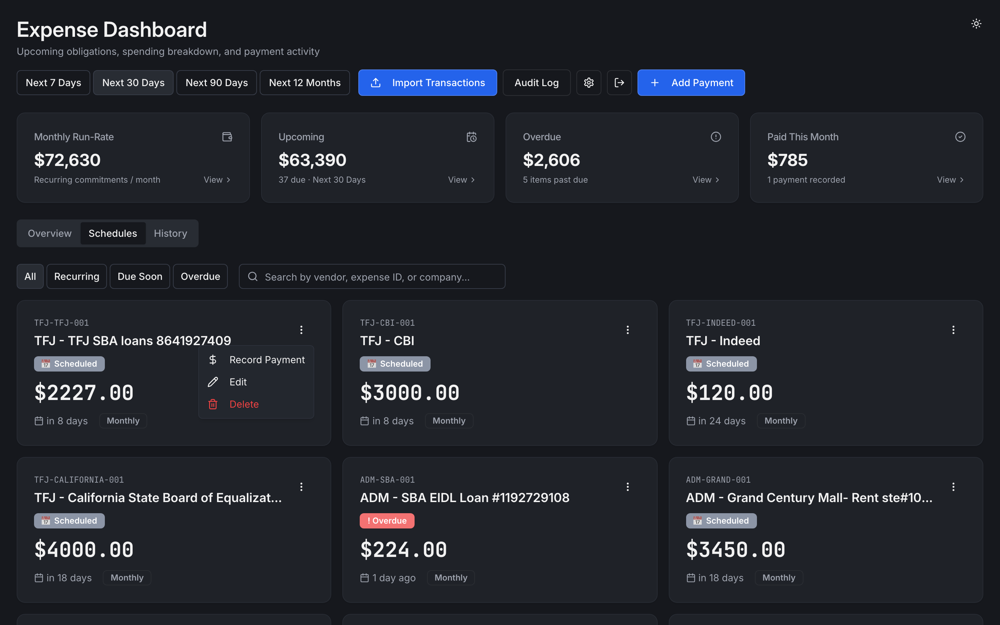

- **Record Payment** — log a payment against this schedule (§10).
- **Edit** — change any field (§11).
- **Delete** — remove the schedule (admins only; asks for confirmation).

If you have no schedules yet, the tab shows an **“Add Your First Payment”** button that opens the same form as **+ Add Payment**.

---

## 9. Adding a payment schedule

Click **+ Add Payment** in the header (or **Add Your First Payment** on an empty Schedules tab).

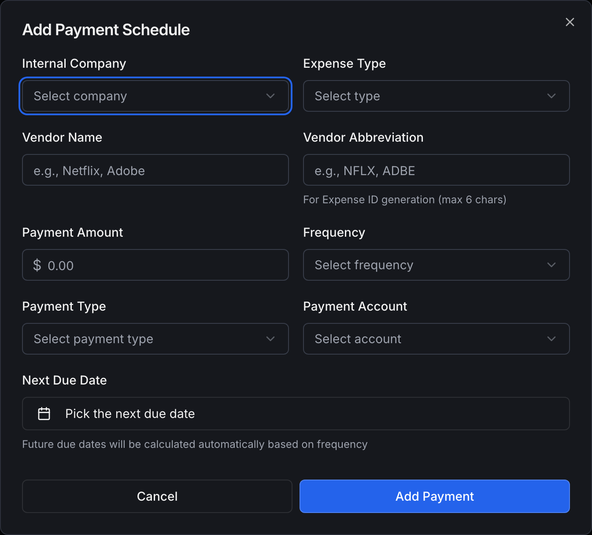

Fill in the form (all fields are required unless noted):

| Field | What to enter |
|---|---|
| **Internal Company** | The entity this obligation belongs to. Pick from your configured companies. |
| **Expense Type** | The analytics category (Rent, Tax, Operating Expense, …). |
| **Vendor Name** | Who you’re paying, e.g. *Netflix, Adobe*. |
| **Vendor Abbreviation** | A short code (max 6 chars), e.g. *NFLX, ADBE*. Used to build the Expense ID. |
| **Payment Amount** | The dollar amount per occurrence. |
| **Frequency** | one-time · weekly · bi-weekly · monthly · quarterly · yearly. |
| **Payment Type** | The method you’ll usually pay with (Check, ACH, Wire, …). |
| **Payment Account** | The account the money comes from. |
| **Next Due Date** | The next date it’s due. *Future due dates are calculated automatically from the frequency.* |

Click **Add Payment** to save. The new schedule appears immediately on the Schedules tab and is counted in the KPIs and forecasts.

> **One-time schedules:** if you choose frequency **one-time**, the app assumes you’re probably paying it now — right after you save, the **Record Payment** dialog opens automatically with the date and amount pre-filled, so you can log the payment in the same step (or cancel if it isn’t paid yet).

---

## 10. Recording a payment

Recording a payment is how you tell the system an obligation was actually paid. You can start it from several places:

- The **⋯ menu → Record Payment** on a schedule card.
- The **Record Payment** button in the Upcoming Payments list.
- The **Record Payment** button on the History tab (for a payment not tied to a specific schedule).
- Automatically, right after creating a **one-time** schedule.

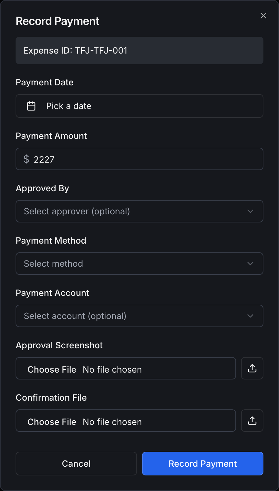

| Field | Notes |
|---|---|
| **Expense ID** | Shown locked when you started from a specific schedule (e.g., `TFJ-TFJ-001`). When recording a standalone payment you pick the Expense ID here. |
| **Payment Date** | The date the payment was made (calendar picker). |
| **Payment Amount** | Pre-filled from the schedule; edit if you paid a different amount (this is what drives the *underpaid / overpaid* flags). |
| **Approved By** | *(optional)* the user who approved the payment. |
| **Payment Method** | Check, ACH, Wire, Credit Card, Debit Card, Bank Transfer, PayPal, Cash, Other. When set to **Check**, the confirmation field captures the **check #**. |
| **Payment Account** | *(optional)* the account it was paid from. |
| **Approval Screenshot** | *(optional)* upload proof of approval (email/Slack/approval-tool screenshot). |
| **Confirmation File** | *(optional)* upload proof of payment (bank confirmation, receipt). |

Click **Record Payment**. The payment now appears on the **History** tab, counts toward **Paid This Month** and the **Spending Trend**, and updates the schedule’s status. If you paid less or more than scheduled, or after the due date, the **Payment Issues** panel will flag it.

> **Best practice:** attach the approval screenshot and confirmation file. They’re optional, but they make the History tab self-documenting for audits.

---

## 11. Editing & deleting a schedule

### Editing
From a schedule card’s **⋯ menu → Edit** (or **Edit Schedule** in the expense detail dialog):

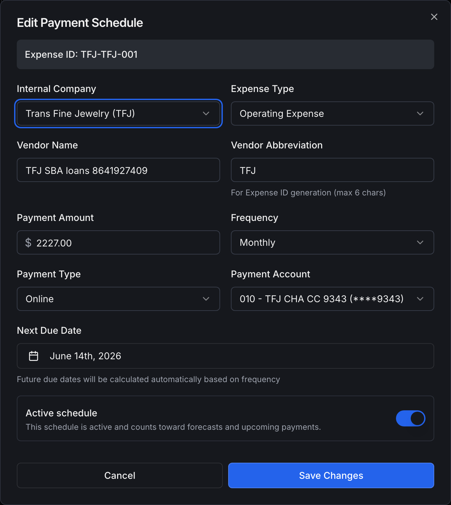

The form mirrors the Add form. You can change the company, vendor name/abbreviation, amount, frequency, next due date, payment type, payment account, and expense type. There is also an **Is Active** toggle:

- **Active** — the schedule counts in KPIs, forecasts, and the issues list.
- **Inactive** — the schedule is kept for history but excluded from all totals. Use this to retire an obligation without deleting its record.

Click **Update** to save.

### Deleting
**⋯ menu → Delete** (admins only) asks you to confirm:

> *“Are you sure you want to delete this payment schedule? This action cannot be undone.”*

Deleting removes the schedule. Prefer **Inactive** over Delete when you want to keep the history.

---

## 12. History tab — recorded payments

The **History** tab is the ledger of every payment that has actually been recorded.

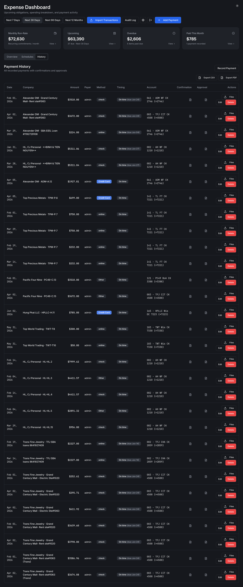

The table columns are: **Date · Company / Vendor · Amount · Payer · Payment Method · Account · Category · Timing · Confirmation · Approval**.

- **Method** is shown as a colour-coded badge (e.g., Credit Card, Bank Transfer).
- **Category** is the payment’s **Expense Type** (e.g., Rent, Payroll Taxes). Payments linked to a schedule show that schedule’s category; one-time/imported payments show **Uncategorized** until you set one (see §13). Set or change it via **Edit**.
- **Timing** reads *“On time (due …)”* or *“N day(s) late (due …)”*.
- The **Confirmation / Approval** columns show whether files are attached.

Per-row actions:

- **View files** — open/download attachments or add new ones (§13).
- **Edit** — change the record, with a mandatory reason (§13).
- **Delete** — remove the record, with a mandatory reason (admins only, §13).

At the top of the table are **Record Payment** and the two **Export** buttons (§15).

---

## 13. Editing, deleting & attaching files to payment records

Because payment records are financial facts, edits and deletions are **controlled and logged**.

### Editing a record
Click **Edit** on a History row:

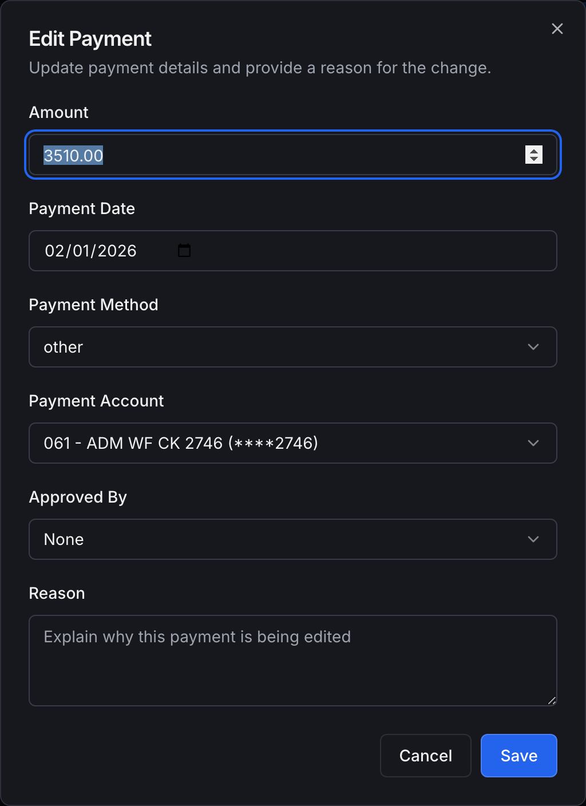

You can update the amount, payment date, payment method, payment account, **category**, and “approved by”. A **Reason for edit** is **required** — it, along with a before/after snapshot, is written to the audit log. Click **Update** to save.

**Setting a category (Expense Type).** The **Category** dropdown lets you classify any payment — this is the only way to categorize an imported one-time payment that isn’t tied to a schedule. Choose an Expense Type, or **Uncategorized** to leave it unset.

- For a payment **linked to a schedule**, the category defaults to the schedule’s Expense Type. Changing it here overrides the category for **this one payment only** — the schedule is untouched.
- Setting it back to **Uncategorized** on a linked payment makes it fall back to the schedule’s Expense Type again.
- Categories come from the **Expense Types** list in Settings (§16.5).

### Deleting a record
Click **Delete** on a History row (admins only):

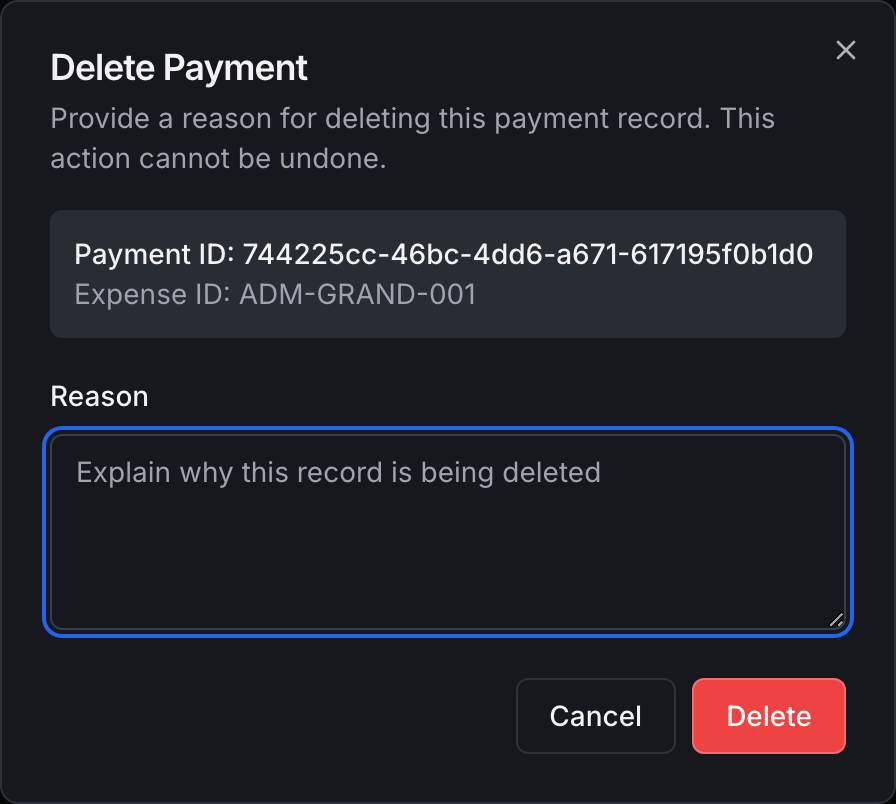

A **reason** is required and the deletion is recorded in the audit log with a snapshot of what was removed. This is a confirmation step, not an undo — be sure before confirming.

### Managing files
Click **View files** on a History row:

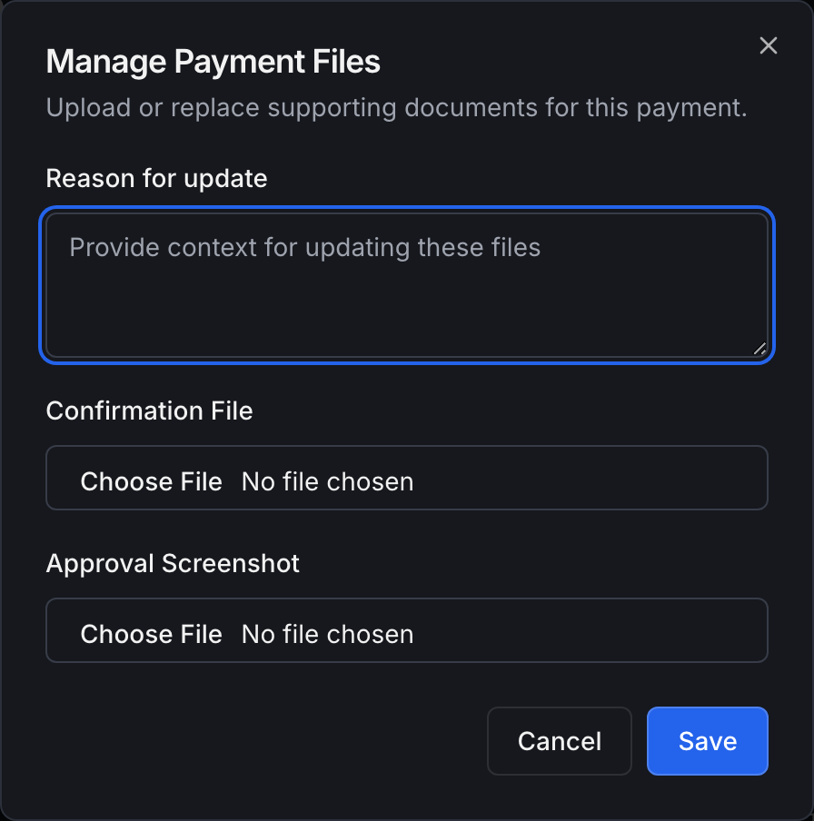

Here you can download an existing approval screenshot or confirmation file, or upload one to add/replace it after the fact. This is how you back-fill documentation on payments that were recorded without attachments.

---

## 14. Importing transactions from CSV

Instead of recording payments one at a time, you can bulk-import them from a bank/card CSV export. Click **Import Transactions** in the header.

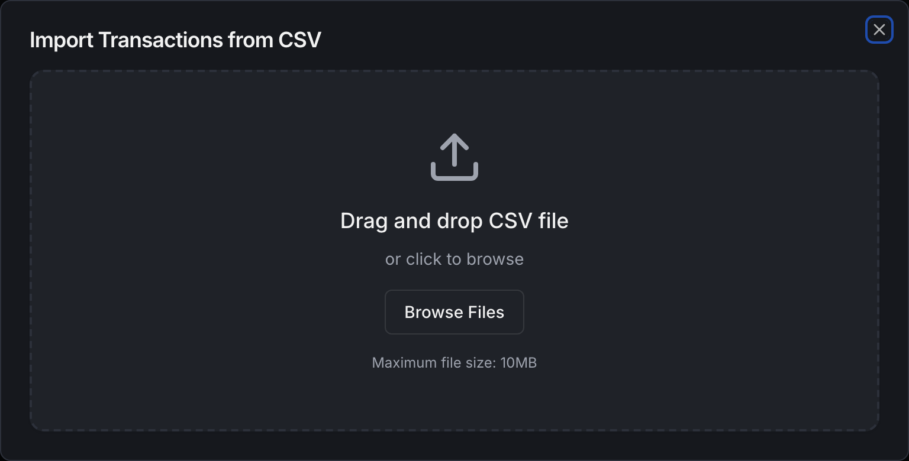

The importer is a three-step wizard:

**Step 1 — Upload.** Drag and drop a CSV file onto the box, or click **Browse Files**. Maximum file size **10 MB**.

**Step 2 — Map accounts.** The wizard finds each unique bank-account name in your CSV and asks you to match it to one of your **Payment Accounts**. You can save these matches as **Account Mappings** (§16) so future imports recognise the same account automatically.

**Step 3 — Review & import.** Each transaction is matched to a schedule by fuzzy matching and labelled with a **confidence** level (high / medium / low / unmatched). You can:

- tick/untick which transactions to record,
- bulk-assign an internal company,
- preview the date, amount, account, matched schedule, and confidence for each row.

Click **Import** to create the selected transactions as payment records in one go. They then behave exactly like manually recorded payments (appear in History, count toward totals, get flagged if late/under/over).

> **Categories on imported payments:** transactions that match a schedule inherit that schedule’s **Category** automatically. Unmatched (one-time) imports come in as **Uncategorized** — open the row’s **Edit** dialog to assign a Category (§13).

> **Get matching right once:** the better your **Account Mappings** and vendor/abbreviation setup, the higher the auto-match confidence and the less manual review each import needs.

---

## 15. Exporting reports (CSV & PDF)

On the **History** tab, two buttons export your payment records:

- **Export CSV** — downloads a spreadsheet of all payment records (for Excel/Sheets, accounting, or reconciliation).
- **Export PDF** — downloads a formatted, printable report of payment history.

Use the tab filters/search first if you want to export a focused subset rather than everything.

---

## 16. Settings — companies, accounts, types, users

Click the **⚙️ Settings** icon in the header. Settings is organised into tabs.

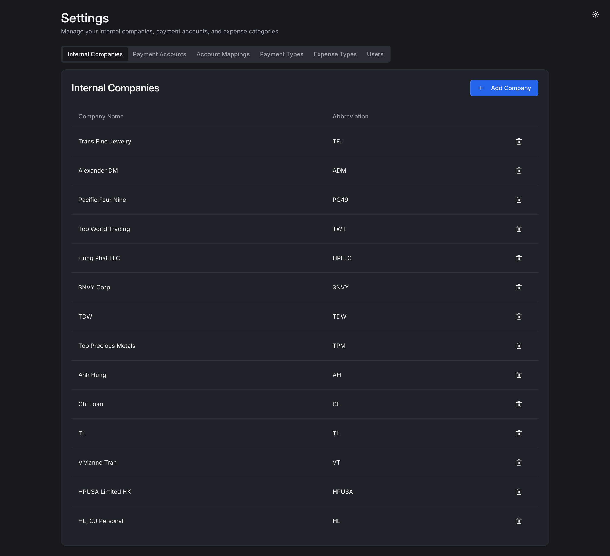

### 16.1 Internal Companies
The list of entities you pay from. Click **+ Add Company** and provide a **Company Name** and **Abbreviation**.

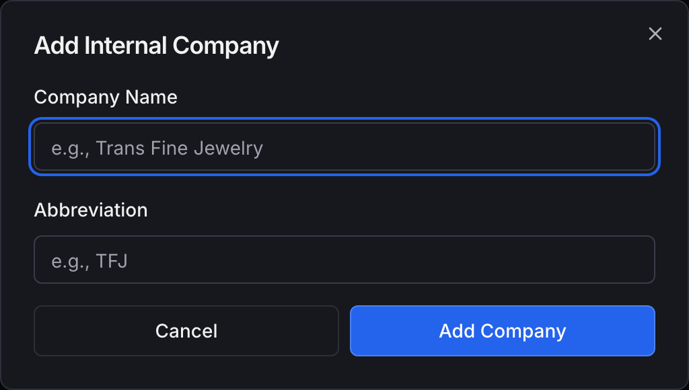

### 16.2 Payment Accounts
The bank accounts/cards you pay with.

Click **Add Account** to create one:

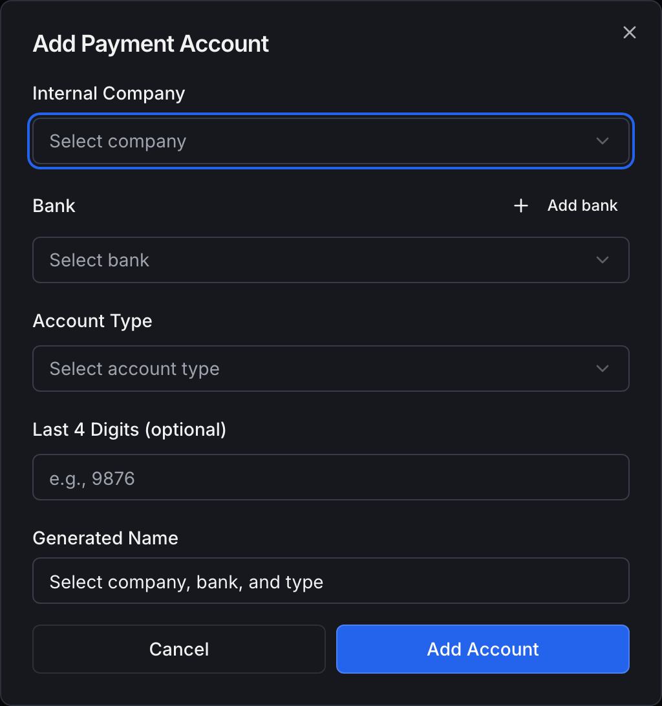

| Field | Notes |
|---|---|
| **Internal Company** | Which entity owns the account. |
| **Bank** | Pick an existing bank, or click **Add Bank** to create one inline (bank name + nickname). |
| **Account Type** | Checking, Savings, Credit, Other, etc. |
| **Last 4 Digits** | *(optional)* the account’s last four digits — the key the app uses to match accounts during CSV import. |
| **Account Name** | Generated automatically from company + bank + type + last 4 (shown as a read-only preview). |

### 16.3 Account Mappings
Maps the account names that appear in your CSV exports to your Payment Accounts, so imports auto-recognise them.

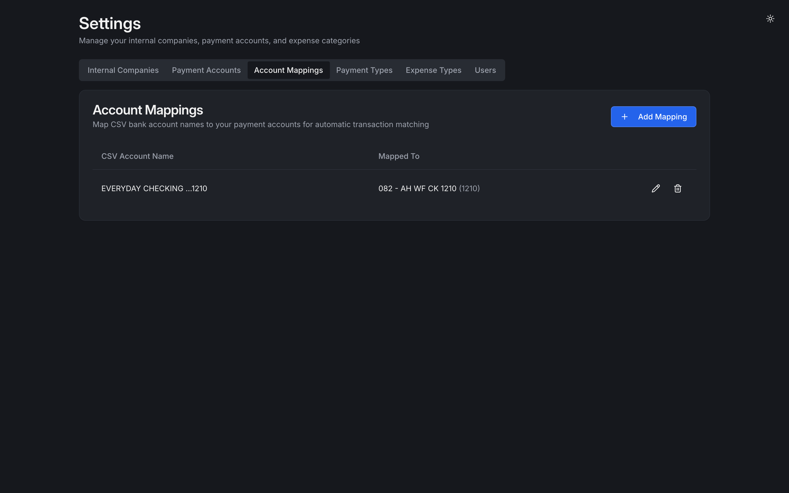

Click **Add Mapping**, enter the **CSV Account Name** exactly as it appears in your file, and choose the **Payment Account** it corresponds to. Existing mappings can be edited or deleted.

### 16.4 Payment Types
The list of payment methods available in the Record Payment form. Add or remove entries as needed.

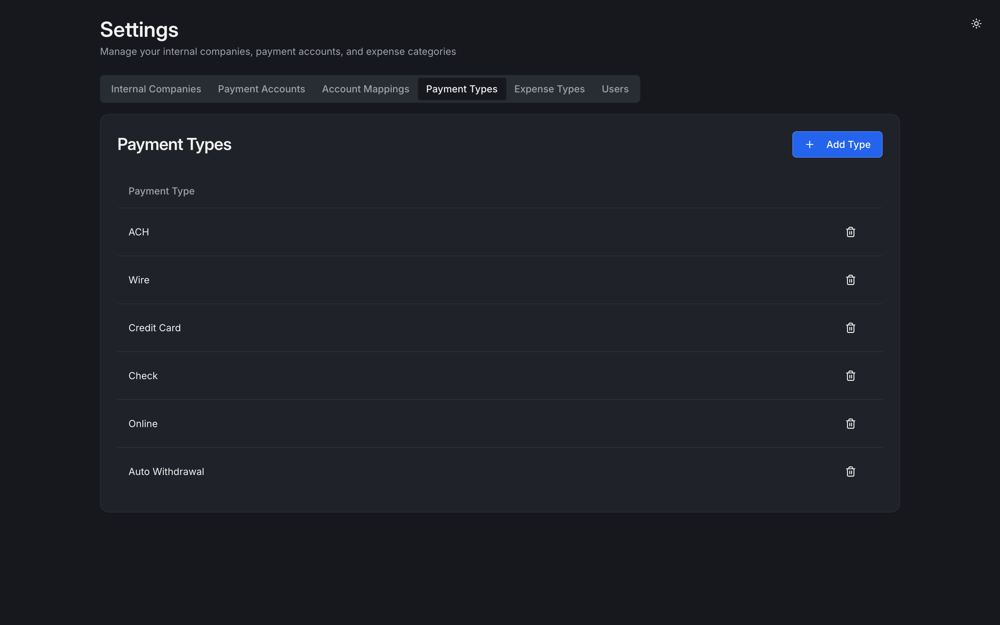

### 16.5 Expense Types
The categories used in the Add/Edit Payment forms and the Expense Breakdown chart.

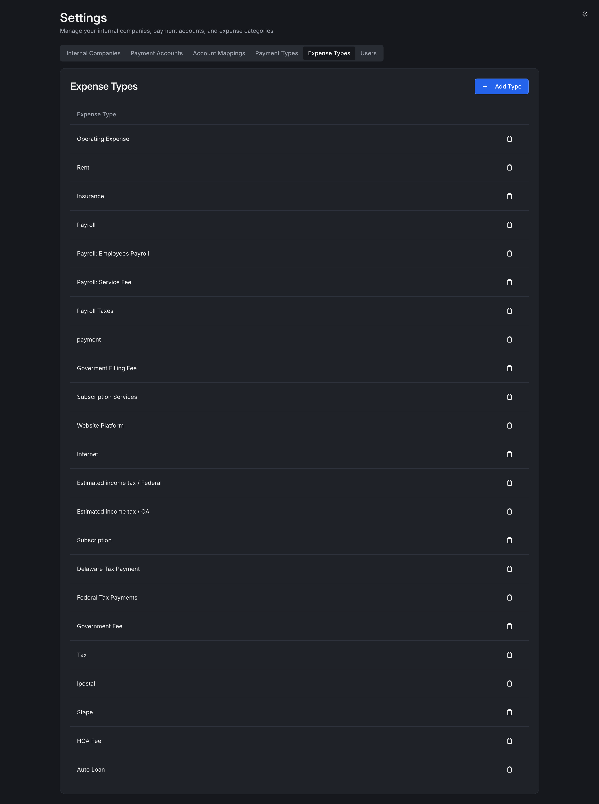

### 16.6 Users *(admin only)*
Manage who can sign in.

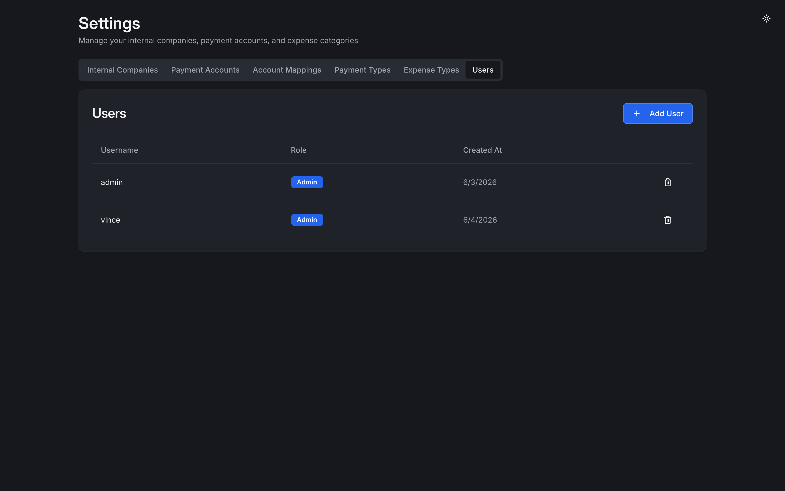

Click **Add User** to create an account with a username, password, and role:

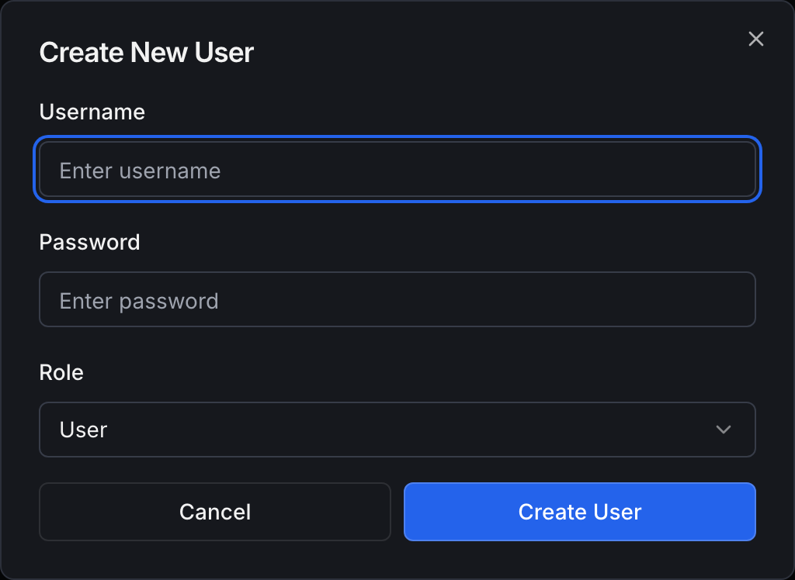

- **Admin** — full access, including deletes, the audit log, and user management.
- **User** — can view, add schedules, and record/edit payments, but cannot delete or manage users.

Existing users can be edited (including password and role changes) or deleted.

---

## 17. The audit log

Open it from **Audit Log** in the header (admins only).

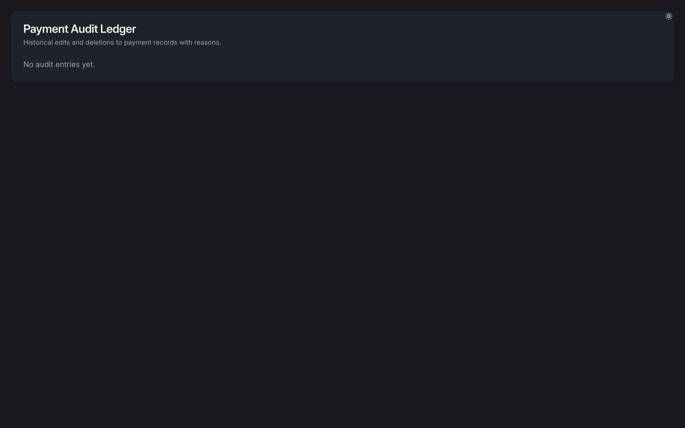

The **Payment Audit Ledger** records every **edit and deletion** of a payment record. When entries exist, each row shows the timestamp, the action (**Edited** / **Deleted**), the payment ID, the **reason** that was entered, who performed it, and an expandable **before/after snapshot** (JSON). Newest entries are listed first.

A fresh system shows **“No audit entries yet.”** — the ledger fills in the first time someone edits or deletes a payment record (§13). It exists so that financial changes are always explainable after the fact.

---

## 18. Roles & permissions

| Capability | User | Admin |
|---|:---:|:---:|
| View dashboard, charts, drill-downs | ✅ | ✅ |
| Add / edit payment schedules | ✅ | ✅ |
| Record payments, attach files | ✅ | ✅ |
| Edit payment records (with reason) | ✅ | ✅ |
| Import CSV, export CSV/PDF | ✅ | ✅ |
| Manage Settings lists (companies, accounts, types, mappings) | ✅ | ✅ |
| **Delete** schedules / payment records | ❌ | ✅ |
| **View the audit log** | ❌ | ✅ |
| **Manage users** | ❌ | ✅ |

Admin-only controls simply don’t appear for regular users (e.g., the Audit Log button and delete buttons are hidden).

---

## 19. End-to-end workflows (recipes)

### Recipe A — First-time setup
1. **Settings → Internal Companies:** add each entity you pay from.
2. **Settings → Payment Accounts:** add each bank/card (add banks inline as needed; include last-4 digits to enable CSV matching).
3. **Settings → Payment Types** and **Expense Types:** make sure the methods and categories you use exist.
4. *(Optional)* **Settings → Account Mappings:** pre-map your bank’s CSV account names.
5. *(Admin)* **Settings → Users:** create logins for your team with the right roles.

### Recipe B — Add a recurring bill (e.g., monthly rent)
1. **+ Add Payment.**
2. Company, Expense Type = *Rent*, Vendor name/abbr, Amount, Frequency = *monthly*, Payment Type, Payment Account, Next Due Date.
3. **Add Payment.** It now appears on Schedules and in the forecast.

### Recipe C — Pay a bill and log it
1. Find the schedule (Schedules tab or the Upcoming Payments panel).
2. **Record Payment.**
3. Set the date, confirm/adjust the amount, choose the method and account, add approver and files.
4. **Record Payment.** It moves into History and updates the KPIs.

### Recipe D — Log a one-time payment
1. **+ Add Payment**, set Frequency = **one-time**, fill the rest, **Add Payment**.
2. The Record Payment dialog opens automatically — complete it and save.

### Recipe E — Month-end reconciliation from the bank
1. Export your bank/card transactions to CSV.
2. **Import Transactions** → upload → map accounts → review confidence and selection → **Import**.
3. Check the **Payment Issues** panel for anything late/under/over and resolve it.

### Recipe F — Investigate and fix a flagged issue
1. **Overview → Payment Issues**, click the flagged card.
2. Review the expense detail and its payment history.
3. **Edit Schedule** or **Edit** the offending payment record (enter a reason) as appropriate.

### Recipe G — Correct a payment with an audit trail
1. **History → Edit** on the row.
2. Change the fields and enter a **Reason for edit**.
3. **Update.** The change is now visible in the **Audit Log** with before/after snapshots.

---

## 20. Frequently asked questions

**Why is an item “Overdue” when I already paid it?**
Because no **payment record** is logged against it yet. Record the payment (§10) and the status updates.

**What’s the difference between Monthly Run-Rate and Upcoming?**
Run-Rate is the steady monthly cost of all *recurring* schedules (normalised to a month). Upcoming is the *actual* total due inside the timeframe you pick in the header, recurring or not.

**Why doesn’t a schedule show up in totals?**
It’s probably **Inactive**. Open it (Edit) and turn **Is Active** on. Inactive schedules are intentionally excluded.

**Underpaid vs Overpaid — how are these decided?**
By comparing the **payment record amount** to the **scheduled amount**. Edit the amount on either the record or the schedule so they reflect reality.

**How is the Expense ID created?**
Automatically from the company/vendor abbreviations plus a sequence number (e.g., `TFJ-TFJ-001`). You only supply the vendor **abbreviation** (max 6 chars).

**Can I delete things?**
Schedules and payment records can be deleted only by **admins**, and payment-record deletions require a reason and are logged. Consider marking a schedule **Inactive** instead of deleting it.

**Where do check numbers go?**
In the Record Payment dialog, set **Payment Method = Check**; the confirmation field then captures the **check #**.

**The CSV import didn’t match my transactions — why?**
Either the bank account isn’t mapped (set it in **Account Mappings**, or include the **last 4 digits** on the Payment Account) or the vendor names differ too much to auto-match. Low-confidence rows can still be confirmed manually in Step 3.

**Does changing the timeframe change my data?**
No. It only changes the *window* used by the **Upcoming** KPI and the **Upcoming Payments** panel. Nothing is modified.

**Who can see the Audit Log?**
Admins only. It’s empty until the first payment-record edit or deletion happens.

---

## 21. Troubleshooting

| Symptom | Fix |
|---|---|
| **A new schedule/payment isn’t showing up** | Refresh the tab; confirm the schedule is **Active**; for Upcoming, check the **timeframe** selector covers its due date. |
| **An account isn’t available when recording a payment** | Add it in **Settings → Payment Accounts** first. |
| **A company/expense type/payment type is missing from a dropdown** | Add it under the matching **Settings** tab. |
| **CSV upload rejected** | File must be **CSV** and under **10 MB**. |
| **CSV rows show “unmatched” / low confidence** | Add an **Account Mapping** and the account’s **last-4 digits**; confirm low-confidence rows manually. |
| **I can’t see Delete / Audit Log / Users** | Those are **admin-only**. Ask an administrator. |
| **Numbers look wrong after an edit** | Open the **Audit Log** to see what changed, when, and why. |
| **I’m stuck in dark/light mode** | Toggle the ☀️/🌙 button (top-right). |

---

*Screenshots in this guide were captured from a live instance of PaySchedManager; the figures shown (companies, amounts, dates) are sample data and will differ from your environment.*
